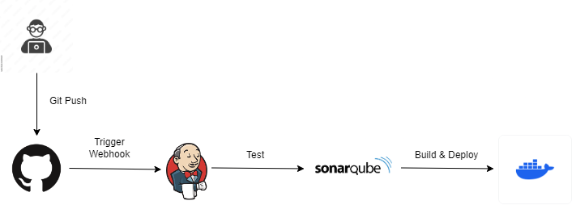
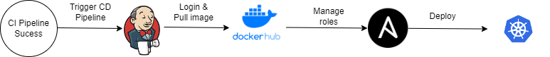
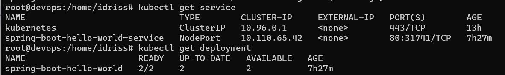
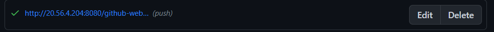
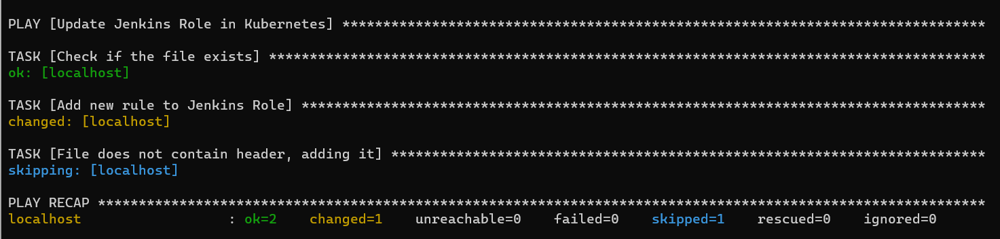
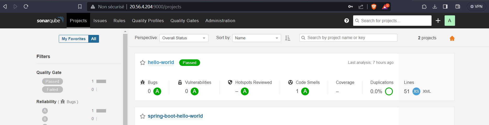
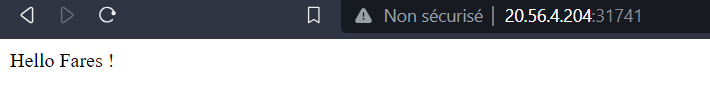

## Devops CiCd pipeline using Jenkins, K8s, Sonarqube, Ansible, Microsoft Azure & Docker 

## CI Pipeline

## CD Pipeline

## Kubernetes Resources

## Github Webhook

## Ansible Playbook result

## Sonarqube testing result

## Accessing the app outside the VM
